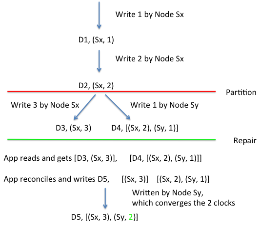

## Amazon DynamoDB

Cluster-level infrastructure for storage

  * Scalable
  * Strong performance SLAs for 99.9% of queries
  * Highly available
  * Sacrifices consistency
  * **Application** expected to resolve version conflicts, not Dynamo

This is Version 1 (2007)

Version 2 has simpler interface

  * Many of same underlying principles
  * Still distinguishes between consistent and eventually consistent reads

## Vector clocks in writes

The first node to do the write "owns" the write's time

  * Replicas (if W > 1) record the "owner's" time

Partition opens room for several "owners"

   * Timestamps diverge
   * When partitions end, app must reconcile

## Client must record vector clocks

Every write preceded by a read to get the current clock

  * Pass that clock value as an argument to the write
  * The node uses that context 

The original paper is [{{site.data.bibliography.decandia2007.title}}]({{site.data.bibliography.decandia2007.url}}).

If you're interested in the full algorithm, David Drysdale has [implemented it in Python]({{site.data.bibliography.drysdale2012.url}}).