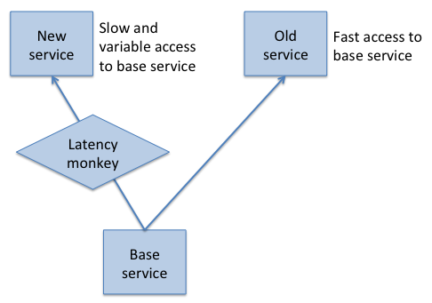

## Resilience

Source: [{{site.data.bibliography.tseitlin2013.title}}]({{site.data.bibliography.tseitline2013.url}}).

"Resilience is an attribute of a system that enables it to deal with failure
in a way that does not cause the entire system to fail."<small>---Tseitlin,
p. 42.</small>

* If a movie recommendation service fails, give users a generic list of titles
* "A complex system is constantly undergoing varying degrees of failure" (p.&nbsp;42)

## Tools for resilience

1. Redundancy and fault tolerance

2. Regularly induce failure

  * Simply listing possible failures helps you understand your system:

     * How far outside the service performance SLA is a "failure"?
     * How many retries before you consider a service "failed"?
     * What if only part of a service is working (say, read but not write)?

  * Automatically (today)
  * Manually (next class)

"Monkeys"---scripts that deliberately fail key services

[Open source versions of Chaos Monkey, Conformity Monkey, and Janitor Monkey](https://github.com/Netflix/SimianArmy)

### Chaos Monkey

Randomly terminates live, customer-facing instances

Ensures that services do not rely on 
* On-instance state
* Instance affinity (has to run on specific instance)
* Persistent connections

Services can set probability or opt out

### Chaos Gorilla

Causes Netflix services for an entire Amazon Availability Zone to fail
* Partitioned mode (both sides continue)
* Total failure (failed zone terminated)

"Causes massive damage" to Netflix's services
* As of 2012, only run manually 
* Increasingly aggressive with every run

### Chaos Kong

Takes down Netflix services for an entire Amazon Region (multiple Availability Zones)

A resilient system cannot be limited to one Zone

Chaos Kong still under development

### Latency Monkey

Introduces delays in client-server communication

Service is still there, just _slow_

Useful for testing resilience of new services
* Increase latency of services they depend upon
* Leave latency unchanged for all other clients of that service

### [Conformity Monkey](https://github.com/Netflix/SimianArmy/wiki/Conformity-Home)

A style checker ("lint") for instances

### [Janitor Monkey](https://github.com/Netflix/SimianArmy/wiki/Janitor-Home)

Locates resources that should be deleted

Notifies owner

Owner has three days to countermand the deletion

### Bringing up Bonzo

Structured introduction of monkeys

* Run in test environment
* Run live with select volunteer services
* Run live with services opting-in
* Run live with services opting-out

## Monitoring

Constantly monitor the health of your system

When users are impacted by a real event, turn off the monkeys

Record all changes to the system

## The organization

Developers operate the services they create

Learn from failures

Blameless culture

## Guide to reading for next class

**Read [{{site.data.bibliography.krishnan2012.title}}]({{site.data.bibliography.krishnan2012.url}}).**

Google's Disaster Recovery Testing event (DiRT) is a complementary approach
to Netflix's Simian Army. Where Simian Army uses automated failures of key services, 
DiRT uses manual failures of key services.