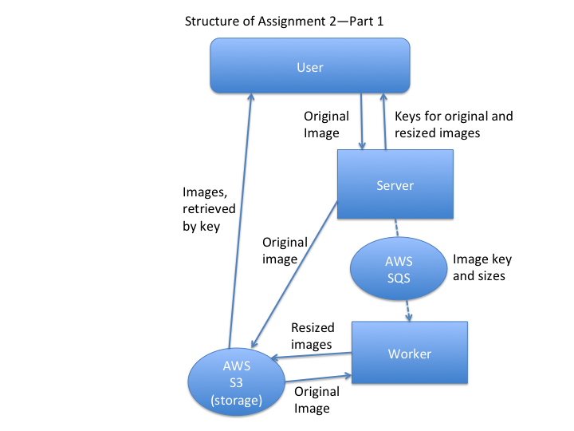
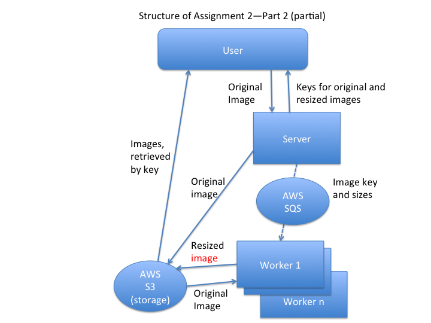
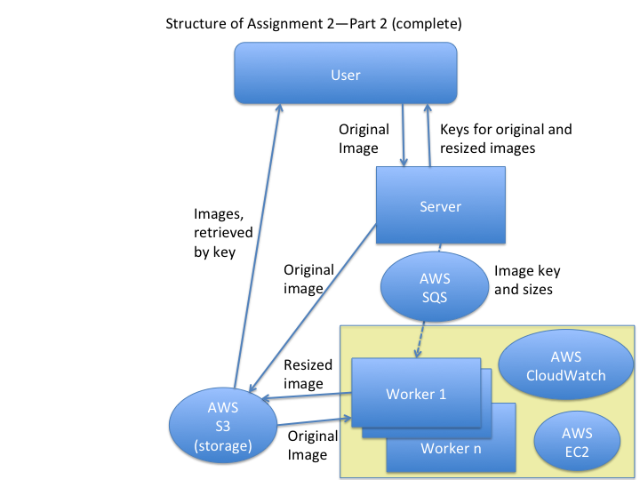

## Distributing computation across instances

In the first part of Assignment&nbsp;2, you are going to build a service, comprising two subservices connected by an SQS queue:

In the second part, you are going to make the system scalable by partitioning the image resizing step across multiple workers:

How many workers is enough? As the number of image resizes grows,
you'll need more workers. To make it _scalable_, you will need to
automatically _provision_ more workers (EC2 instances):

## Reading guide for next class

**Complete [{{ site.data.bibliography.dean2013.title }}]({{ site.data.bibliography.dean2013.url }}), from "Cross-request long-term adaptations" to end.**

You might also consider rereading the sections on "Hedged requests" and "Tied requests".

Key points to look for:

* What is a good trade-off of partitions of the data?
* How do large information retrieval systems (such as search services) differ from other services?