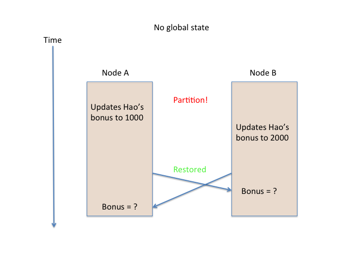

## What makes a cloud application "distributed"?

### Our system model <small>([Takada, Chap. 2]({{site.data.bibliography.takada2013.url}}abstractions.html))</small>

* Nodes run independently
* No shared memory or shared clock
* Network may reorder or lose messages
* Nodes can fail but do not have bugs and cannot be hacked
  * Handling buggy or hacked nodes imposes even more overhead (see [Byzantine fault tolerance](http://en.wikipedia.org/wiki/Byzantine_fault_tolerance))

Implications

* A node only has fast access to its own state
* Global time order cannot be observed

  * From the system's perspective, there is no global order unless the system enforces one

* Global information is potentially out of date or inconsistent

* Crashes differ from network partitions

   * A crashed node cannot update
   * A partitioned node _can_ update
   * A node on the other side of the partition cannot tell if updates are occurring inside it

### [The consensus problem]({{site.data.bibliography.takada2013.url}}abstractions.html)

Nodes achieve **consensus** if they all agree on some value, such as:

* Value of an entry that two nodes have updated
* Ordering of actions performed by several nodes
* Completion of a shared action

### CAP: Tradeoffs between Consistency, Availability, Partitioning

Brewer's CAP "Theorem" (2000):  Consistency, availability, partition tolerance---pick any two:

Source:
[{{site.data.bibliography.takada2013.title}},&nbsp;Ch.&nbsp;2]({{site.data.bibliography.takada2013.url}}abstractions.html). Note:
Paxos, Two-phase commit (2PC), and Gossip are algorithms

Not really a theorem

* More an argument to expand the design space
* Can't choose to have availability without partition tolerance
  * If your system stops at a partition, it is unavailable
* There are many kinds of consistency
* You will make different tradeoffs for different services in a system:

  * Fine to be off by one on count of Twitter followers for Beyonc&eacute;
  * Not so fine to book two weddings in the same room the same time
  * Consider compensation methods

* Seth Gilbert and Nancy Lynch proved a specific case of CAP Theorem
  * But their assumptions do not apply to all systems
  * More in [their 2012 article]({{site.data.bibliography.gilbert2012.url}})

## Guide to readings for next class

**Read
  [{{site.data.bibliography.takada2013.title}}]({{site.data.bibliography.takada2013.url}}abstractions.html)**,
  from "A system model", up to but not including "Strong consistency
  vs. other consistency models".

**You can skim:**

* The formal definition of the consensus problem
* The section, "The FLP impossibility result"

**The key points:**

* Different assumptions about _what_ can fail and _how_ it can fail
* How those assumptions can make algorithms simpler or more complicated
* The zones of the CAP Venn diagram