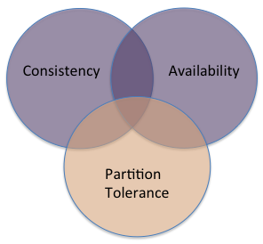

## Answers to some midterm questions

(In class)

## CAP categories

The Consistency, Availability, and Partition Tolerance regions:

<small>After [Takada, Chapter 2]({{site.data.bibliography.takada2013.url}})</small>

Many traditional database systems favour Consistency and Availability over partition tolerance (CA):

Any node in the system will always give the same answer, no matter what
sequence of reads and writes the system has seen. But it cannot run at all if any node is partitioned.
(This isn't really "available" at all.)

Some systems offer Consistency and Partition Tolerance but give up availability (CP):

As with CA systems, any node that is _available_ will give you the same
answer, regardless of the sequence of reads and writes. If there is a
network partition, the main body will continue (provided it is large enough
to have a quorum), while the smaller part will not accept writes. The smaller
part might run in read-only mode but will get increasingly out of date.

Finally, systems might offer Availability and Partition Tolerance but give up consistency (AP):

These systems will remain available, accepting reads and writes even in the case of network partitions. Their tradeoff
is that **different nodes might give different results to the same query**.

## Guide to reading for Wednesday

Read
[{{site.data.bibliography.katsov2012.title}}]({{site.data.bibliography.katsov2012.url}}),
from the beginning up to but not including, "Anti-Entropy Protocols, Gossips".

What to look for: This post is dense, filled with detail, and the diagrams
are complex. We won't be studying every approach Katsov describes. The key point is the tradeoffs
from weakest consistency (eventual consistency) to strongest. What is the price you pay to get the 
strongest consistency? What is the programming complexity you must put up with if you accept
the execution efficiency of weak consistency?