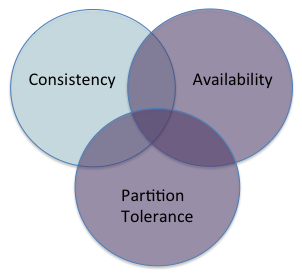

## Emphasizing availability when partitions occur

<!-- <small>Source: [{{site.data.bibliography.brewer2012.title}}]({{site.data.bibliography.brewer2012.url}})</small> -->

So long as there are no network partitions (most of the time), a system can be strongly consistent and available:

* Strongly consistent: The users cannot tell if the system is one instance or multiple instances

  * Every user sees the same order of updates to a value

* Available: Every user can do every possible operation

It won't come free---there will still be latency costs to sustaining the illusion of a single system

* Update messages between the instances

* Waits for multiple synchronous writes to occur to replicas

  * Limited by the slowest instance

  * The number of write instances will typically be much smaller (1-3) than the number of compute instances we considered in large-scale computation (1000s)

  * The problem of one very slow instance remains

### Time outs define "partitions" for a client

Every service request has a time out

* If request does not complete within time out bound, the client must respond

* Might retry one or more times, but when the final retry times out?

The **partition decision**: How your code responds
to timed-out requests determines whether your system is strongly consistent
or available:

1. Keep retrying (maybe with longer time out limits) until requests start working (give up availability but remain strongly consistent); or

2. Enter partition mode, continue serving the user (give up strong consistency but remain available)

Each client makes its own decision about "partition". **One client can see a partition while another client does not.**

How long do we set the time out value?

* Short (100s of ms)---we assume a failure quickly

  * Induces lots of partitions

* Long (seconds)---takes time to detect a failure

  * Longer latencies

  * Fewer partitions

### Relaxing consistency

If we abandon the requirement that all users see the same order of updates (strong consistency), what do we gain?

* Greater scalability

* Lower latency

* Partition tolerance

"Eventual consistency" is an ambiguous promise: If you stop updating the
system, and wait "long enough", the system will converge on "some
value"---every user will eventually see the same value.

* Trivially (but uselessly) achievable by returning an arbitrary value to every query (answer every question, "42")

* More usefully, is the application able to occasionally converge to an _out of date_ value?

* Or could your service return multiple values, letting the user pick the most useful one?

Those are the _best_ you can do after a partition

* In the general case, you cannot guarantee that your system will converge to a single, latest value

* Some specialized operations do permit this guarantee <small>(See CALM theorem and Converget Replicated Data Types, CRDTs)</small>

  * But you will not be able to build a full application using only these operations

  * So you'll have to make some hard decisions

### Maintaining business rules and data structure invariants

An application typically has business rules it must maintain

  * A bank account cannot be negative

  * A flight cannot carry more passengers than seats

These imply invariants across your data structures



<pre><code>if user.account - withdrawal &lt; 0.00:
    raise Overdraft
</code></pre>



Relational database systems offer key constraints to ensure some invariants

* A Purchase record cannot be created with a nonexistent customer id

**You can't guarantee the invariants if you keep running while partitioned**

But in many cases you have compensation strategies

* Banks permit an ATM to dispense small amounts (up to $200, say) when they are cut off from the server

* If customer overdraws, bank adds service charge

* Airlines routinely overbook flights

  * Rare for every passenger to show up

  * If too many show up, offer free tickets to the ones willing to wait for a later flight

When designing for partitioned operations, which invariant violations can you compensate, which invariants must you never violate?

* OK to send someone two copies of a book

* Probably not OK to give patient twice their drug dosage

## Guide to reading for next class

**Read [{{site.data.bibliography.takada2013.title}}, Chap.&nbsp;5]({{site.data.bibliography.takada2013.url}}/eventual.html):** up to but not including "Replica synchronization: gossip and Merkle trees".

**Important points:** "Eventual consistency with probabilistic guarantees"---this is the normal definition of _eventual consistency_.

**Points not important to this course:** "eventual consistency
with strong guarantees" (CRDTs and CALM)---this remains a research topic, with few to no
applications built using this concept.

**Important section:** Reconciling different operation orders

