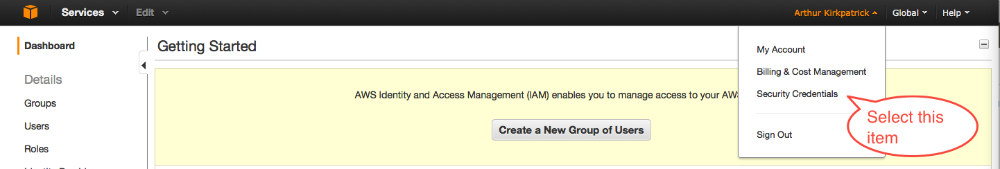
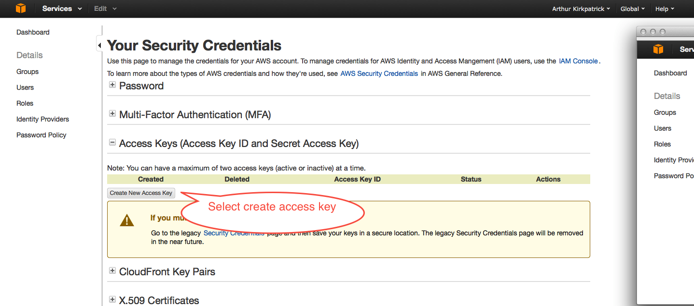
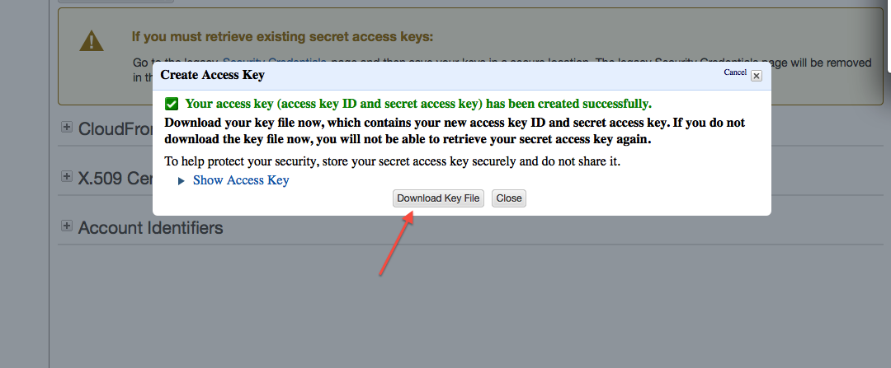
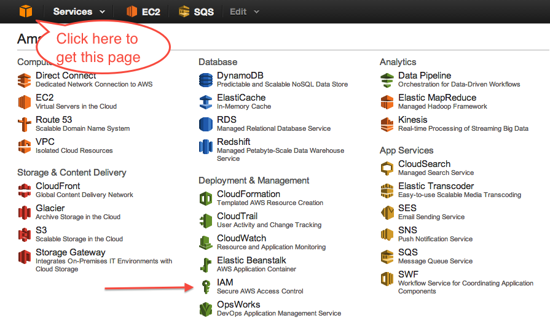
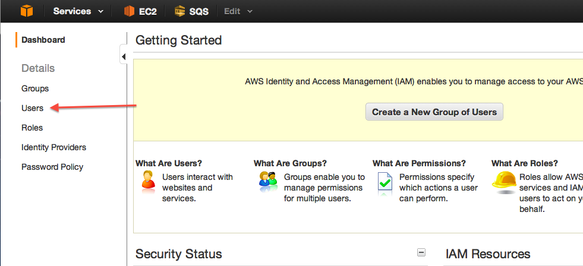
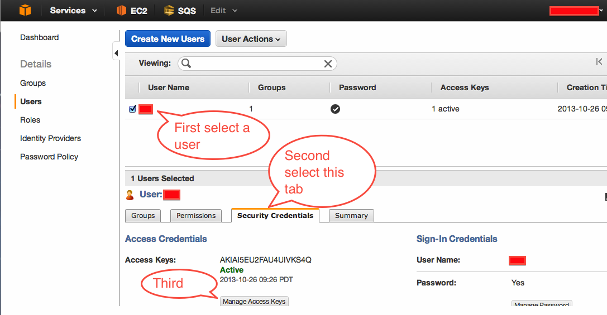
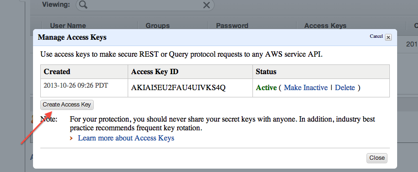
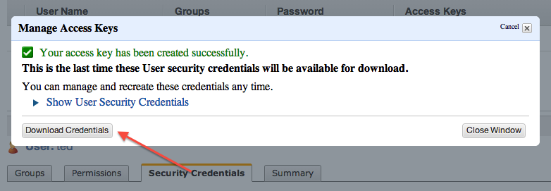

This tutorial shows you how to create an access key pair for AWS. You use
these keys to make REST calls from tools like boto.

The sequence of steps depends upon whether you are
creating keys for a root id or an IAM id. You only need to do this for one
kind of id.

## Creating access keys for an AWS root ID

* Sign on to your root ID. In the upper right corner of the console, there
is a menu that you can drop down from your name. Select the "Security
Credentials" item: 

* On "Your Security Credentials", expand the "Access keys" item.

: 


On the expanded item, press "Create New Access Key". Note that if you have
two active keys already created, you will not be able to create any
more. Delete one of your existing keys and you will be able to create a new
pair. 
 

* At the bottom of the "Create Access Key" dialogue, you will see a button, "Download key file". Click it. 
 
Pick a name for your file such as "access-keys.csv". Be sure to retain the .CSV filetype.

* Move your file to a secure directory and set its permissions so that only you can read it.

* **You're done!**

## Creating access keys for an IAM identifier

* Sign in to your IAM ID.Get the list of AWS services by clicking on the
  orange box in the upper left corner. Then select the IAM service: 

* From the IAM page, select "Users": 

* On the Security Credentials page, select a user, go to the Security
  Credentials tab, and click on the "Manage Access Keys" button. 

* At the bottom of the "Manage Access Key" dialogue, you will see a button,
"Create Access Key". Click it.  Note that if you have two active keys
already created, you will not be able to create any more. Delete one of your
existing keys and you will be able to create a new pair.   

* At the bottom of the "Manage Access Keys" dialogue, you will see a button, "Download Credentials". Click it. 
 
Pick a name for your file such as "access-keys.csv". Be sure to retain the .CSV filetype.

* Move your file to a secure directory and set its permissions so that only you can read it.

* **You're done!**

