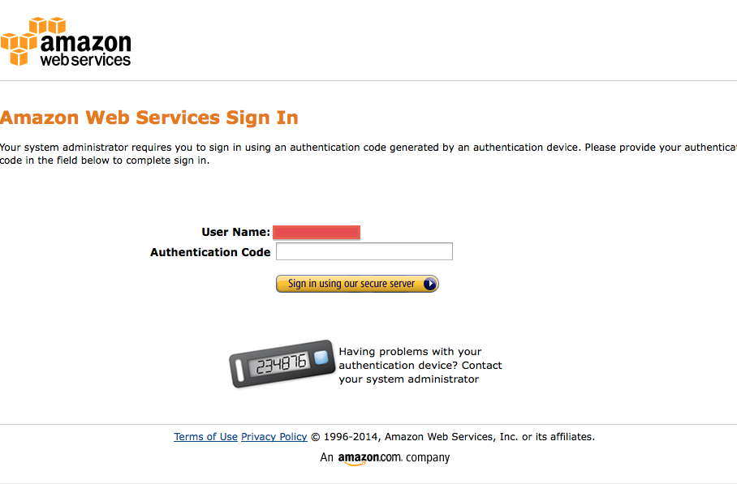
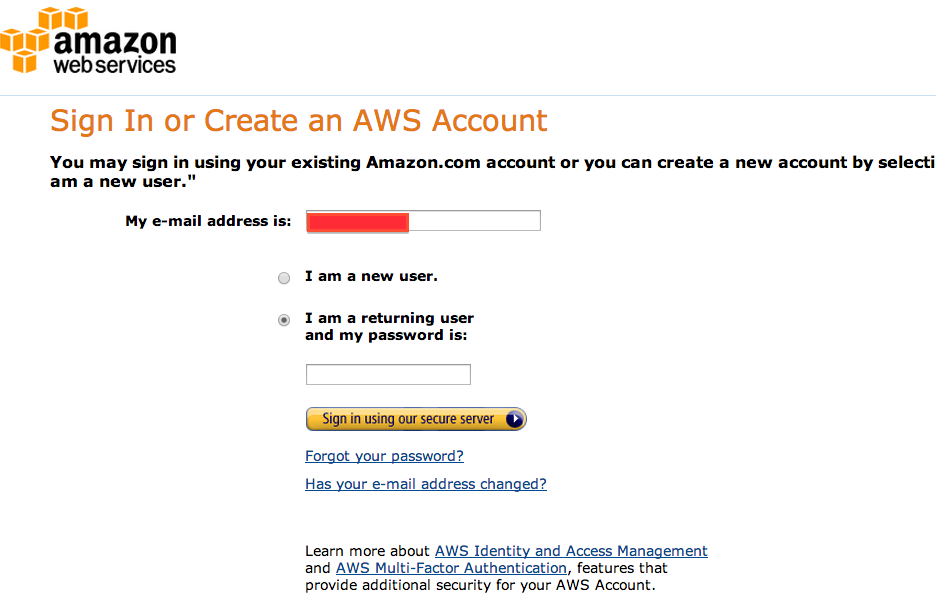
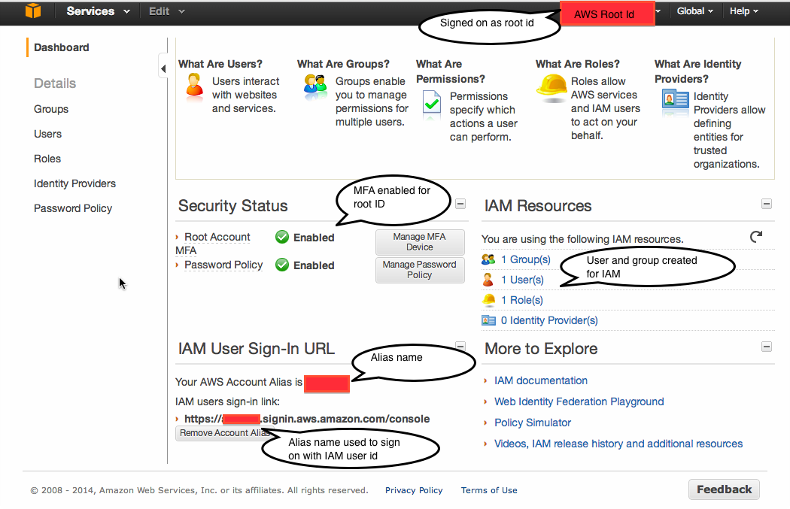

__Assignment value:__ 2% of total course grade.

__Assignment evaluation:__ Full credit will be awarded for creating a
root AWS id. For safety purposes, we recommend that you at least add
MFA (Step 2) and preferably IAM (Step 3). But these steps are not required.

__Assignment due:__ Sunday Jan. 12, 23:59.

## Turn in

Upload to [CourSys](http://courses.cs.sfu.ca/) a screen shot of your signon.

* If you have IAM and MFA (Steps 2 and 3), take a screen shot of your MFA authentication request for your IAM id. Sample shot: .
* If you have just IAM (Step 3), take a screen shot of your IAM sign on.
* If you just have an AWS root account with MFA (Step 2), take a screen shot of your MFA authentication for your root account.
* IF you just have an AWS root account (but not MFA) (Step 1), take a screen shot of your root AWS sign on. Sample shot:
.

## Description

During the course, you will be doing exercises to gain familiarity
with Amazon Web Services (AWS). The larger programming projects will
all be done on {{site.serName}}, where you won't be charged for
computation and we can control the environment. But we also want to
give you experience using basic AWS services, whether through their
Web-based console interfaces or making simple calls from Python. To do
this, you first need an AWS id. In fact, I recommend that you create
_both_ a root ID and an IAM id. I'll explain the difference below.

This week's exercise is administrative: You will create an AWS user id and set
its security parameters. This is at once both trivial and tedious. It
takes several hours of work and at the end you won't have a single
line of code to show for it. But it is a prerequisite for every use
of AWS in the coming weeks, so best to start now.

## Steps to getting an AWS ID and IAM id

### Step 1: Set up your root AWS account

Although you can use the same email address for your AWS Id as you use
for your Amazon id, your AWS Id needs you to enter a password and
credit card number. You can use the same password and credit card as
you use for Amazon.com or you can use different ones. I recommend at
least using a separate password, on the general security principle
that every site should have a distinct passsword.

### Why you should care about AWS security

You could just stop here. But I __recommend that you follow through
with the following steps.__ Your AWS id is backed by your credit
card. As your system is currently configured, anyone who knows your
AWS password can run huge computations on the service--- __at your
expense__. If you uncover this situation, your only recourse will be
to delete your account to prevent future misuse and pay the large bill.

You can increase protection in two ways:

* Set up multifactor authentication (Step 2), requiring any user to have your cell phone when they sign on

* Set up an IAM subaccount (Step 3), which can be deleted or restricted without affecting your root account.

Amazon's many forms of security can be confusing.  They provide a
[summary of all their
credential types](http://docs.aws.amazon.com/general/latest/gr/aws-sec-cred-types.html).

### Step 2: (Optional) Set up multifactor authentication

AWS allows you to set up multifactor authentication for your
accounts. Steve Gibson (of [Security
Now](https://www.grc.com/SecurityNow.htm)) describes multifactor
authentication as, "Something you know and something you have". It
increases the security of your account beyond just a password
(something you know) by adding the requirement that a user has to have
your phone (something you have) to login.  Google provides a [simple
description](http://www.google.com/landing/2step/?utm_campaign=en&utm_source=en-ha-na-us-sk&utm_medium=ha#tab=how-it-works)---but
note that clicking on the "Get Started" link on that page will add MFA
to your _Google_ account, not your AWS account.

The most straightforward way to add your smart phone to your AWS
authentication is to download Google's Authenticator app (see the
["Virtual MFA Applications" list](aws.amazon.com/iam/details/mfa/))
and [configure your AWS
account](docs.aws.amazon.com/IAM/latest/UserGuide/GenerateMFAConfigAccount.html)
to use it for sign on to your root account.

### Step 3: (Optional but highly recommended) Set up an IAM id from which to work

You can do everything you need from your Amazon account id __but__
some security issues remain. If someone hacks your account you have no
way of turning it off.  A more secure solution is to set up a separate
account under AWS's Identity and Access Management (IAM) and do all
your work from there. If someone hacks into your IAM account, you can
sign in to your root AWS account, disable the hacked IAM account, and create a
fresh IAM account to work from.

Amazon describes [the differences between a root id and IAM id](http://docs.aws.amazon.com/general/latest/gr/root-vs-iam.html).

**Added Wed Jan. 8** There are some subtleties to IAM that can trip
you up. Consider the following screen, taken while signed on as the root AWS ID, setting up an IAM id:

The top right corner of the screen lists my root ID (I've obscured it
under a red box for security purposes). The middle left shows that
I've set up MFA and password policies for my root id.  The middle
right shows that I've created a group and a user for IAM.  You have to
create a group first, then add an IAM user to that group. Give the
group "Administrator Access" permissions---the highest level.

The lower left is the subtlest part. This lists the URL from which you
sign on using your IAM id. Initially, it will include your AWS account
number, so it will look like
<code>https://1234567890.signin.aws.amazon.com/console</code>. That's
neither easy to type nor remember, so Amazon lets you set an "alias"
by pressing a button just below the signing URL. You can pick anything
you want, but it will have to be different from any other AWS user's
alias.

Once you have set your alias, say to <code>chenaws</code> then your
signon will become
<code>https://chenaws.signin.aws.amazon.com/console</code>. These are
indicated by the red rectangles on the lower left.

Now when you want to sign in to AWS using your IAM id, put the above
URL into your browser. Then AWS will ask you for your IAM id and
password and (if you've set MFA on the IAM id) then your MFA number.

### Step 4 (Optional) Give your IAM account access to your AWS billing pages

If you're doing all your work from an IAM account, it is annoying to
have to sign in to your original AWS account to find out how much
you've used the system in the past month.  By default, your IAM ids
cannot access your AWS billing pages---even if you give the IAM id
full privileges.

To give your IAM account billing access:

* From your _root account_, select the "Billing & Cost Management" page
from the menu at the top right, where your root account name is
listed.
* On that page, select "Account Settings" in the left-hand
menu. 
* Midway down that page, locate the "IAM Access to Billing
Information".
* Click on the "Edit" link to the left and you will see
two check boxes, labelled "Activate Bills Page" and "Activate Usage
Page".
* Check them both and click "Update".

Now you will be able to do everything you need, including check
whether you've exceeded the Free Tier, from your IAM id. You can keep
your root AWS id in reserve in case the IAM id is hacked.