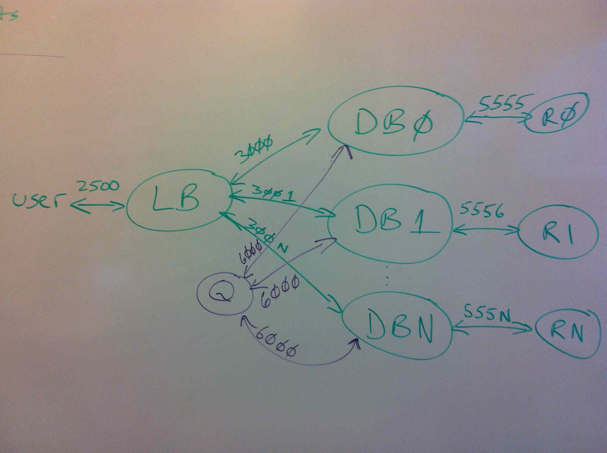

## Overview

In this assignment, you will create a reliable, scalable data store. In the
notation we use in this course, the store has N replications, W=1 (one
replica written by synchronous write) and R=1 (one replica read by
synchronous read). After the primary node has been synchronously written,
the new value will be distributed to the replicas via a simple gossip
algorithm.

By default, reads will be strongly consistent, but an
optional parameter will allow the user to request an eventually consistent read.
Eventually consistent reads will allow a faster implementation, although for
the scales used in our test examples you're not going to be able to measure
the difference.

The code required to implement this is in fact fairly simple. The boilerplate
we provide you will implement the communications protocols and the central
queuing mechanism. The challenge for you will be to understand the architecture
and faithfully implement it. We've spent the semester looking at
architectural issues; building this system will give you a chance to think
through these details on a system of your own.

This writeup is considerably longer than for the other assignments. This is
partly because it is giving more details than the earlier assignments,
partly because we're specifying in this document things that were in code
for previous assignments, and partly because the focus in this assignment is
the architecture.  Read the entire document before starting.

## The architecture

The system has four services, each accepting requests over a different TCP port:



* The Load Balancer service (LB) accepts requests over port 2500. This service is implemented as
a single process for our assignment. You will implement the LB code. You can use your hash algorithm
from the first Tea-emporium assignment. This file must be named `serverLB.py`.

* The Database service (DB) accepts requests over consecutive ports starting at 3000. There are N instances
of the DB process, running identical code but handling different shards of the key space. You will implement
the DB code. This file must be named `serverDB.py`.

* The Queue service (Q) accepts requests over port 6000. This service is implemented as a single
process. We provide the Q code, `serverQ.py`---you simply call it.

* The Redis services (R) accept requests over consecutive ports start at 5555. There are N instances of
the R process. The R code is the same Redis server you have been running for all the assignments.

## The Load Balancer Service (LB)

The load balancer process is the interface to the whole service. It is the
endpoint for all user requests. To write to the store, the user sends a `PUT`
request to port 2500. The data for these requests is identical to those for
the second Tea Emporium assignment (the most recent assignment): a key (a
tea name), a single rating for the tea, and a single vector clock giving the
time for the rating.

The load balancer routes the request to the database instance storing the
shard for this key. You can reuse your hash function from the first Tea
Emporium assignment to assign keys uniformly across the shards. But note
that unlike the first assignment, in this assignment the load balancer
will be **passing the reads and writes to a DB process, not directly
to Redis.**

To read from the store, the user sends a `GET` request to port 2500. The syntax
for this is the same as both of the previous tea examples. The load balancer
routes this `GET` request to the same database instance to which it sends `PUT`s.
This database instance is called the _primary instance_ for that key.

The `GET` requests have an optional argument, specifying an eventually
consistent read. The query parameter is `consistency=weak`. The load
balancer passes eventually
consistent reads to a _random_ DB instance, not necessarily the
primary instance. As we will see in the discussion for the
database instances, reading from a random instance
might give you an older value.

### Specification for the Load Balancer

**Example Write:** Assume you want to rate the tea named "persimmon" as "1" at time {"c0":1}.
From the command line (for testing):

```
  curl -XPUT -H'Content-type: application/json' -d'{"rating": 1, "clock": {"c0":1}}' http://localhost:2500/rating/persimmon
```

From Python (in test routines):

```python
  headers = { 'Accept': 'application/json', 'Content-type': 'application/json' }
  data = json.dumps({ 'rating': rating, 'clock': clock.asDict() })
  requests.put('http://localhost:2500/rating/persimmon', headers=headers, data=data)
```

**Example Read (Strongly Consistent):** Assume that you want to read the values for the tea named "persimmon". From the command line (for testing):

```
  curl -XGET http://localhost:2500/rating/persimmon
```

From Python (in test routines):

```python
    headers = { 'Accept': 'application/json' }
    request = requests.get('http://localhost:2500/rating/persimmon', headers=headers)
    data = request.json()
    # Values now in data['rating'], data['choices'], [VectorClock.fromDict(dc) for dc in data['clocks']]
```

**Example Read (Weakly Consistent):** Assume that you want to read the values for the tea named "persimmon" and are willing
to tolerate somewhat out-of-date values. From the command line (for testing):

```
  curl -XGET http://localhost:2500/rating/persimmon?consistency=weak
```

From Python (in test routines):

```python
    headers = { 'Accept': 'application/json' }
    request = requests.get('http://localhost:2500/rating/persimmon', headers=headers, params={'consistency': 'weak'})
    data = request.json()
    # Values now in data['rating'], data['choices'], [VectorClock.fromDict(dc) for dc in data['clocks']]
```

## The Database Service (DB)

The database service is a set of N instances. Each instance is the primary shard for 1/N of the keys and the
replica shard for every other key. Users never directly call the DB service. Instead, the user sends requests to
the load balancer, which routes them to the primary DB instance for the key (for all writes and strongly consistent
reads) or a random DB instance (for eventually consistent reads). The DB instance in turn reads the value
from its associated Redis server, merges the new rating and clock with the rating, choices, and clocks that
were read from Redis (using the algorithm you developed for the last assignment), and writes the merged
values back to Redis.

As described so far, the database service seems unnecessary, an extra layer added to the structure of the first
Tea Emporium assignment, contributing no value. The database instances are in fact performing an important
service _in the background_: They are replicating copies of recent writes via a _gossip protocol_.

As stated in the load balancer section, every key is mapped to a primary database instance by the hash function.
In the first Tea Emporium, that was the only location where the key's value was stored, its shard. In this
assignment, the primary instance remains the authoritative source, guaranteed to contain the most up-to-date
value, but the rating for tea is also replicated across all the other nodes. Because the replications are
shared in the background, they might be out of date compared to the value in the primary instance.

### DB Gossip protocol

Every time a database instance receives a write request, in addition to merging the new rating and time into the
value saved on this instance's Redis server, the DB process also saves the merged value for later gossip. Once it
has accumulated `config['digest-length']` ratings, it enqueues them for its neighbour DB instance to save as replicates.
The neighbour is defined as the instance with the next-higher number, with the neighbour of the highest-numbered
instance being Instance&nbsp;0. The number of DB instances is given by the global variable `ndb`.

For example, if `ndb == 3`, the neighbours would be: db0 => db1, db1 => db2, db2 => db0. This process is called
a _gossip protocol_.

An instance communicates with its neighbour via the queue (Q) service. The details are specified in a later section. For now,
we'll simply say that each DB instance has a channel on the queue, named after itself. Thus DB Instance&nbsp;1 would
enqueue its gossip values on channel `db1`, while its neighbour DB Instance&nbsp;2 would read from channel `db1` to
get values it needs to replicate. For its part, DB Instance&nbsp;2 would have a channel `db2` on which it would send
gossip values to its neighbour, DB Instance&nbsp;3.

Here is the gossip algorithm:

**Sender**

On every write request (rating, clock):

```python
  #  the global variable digest_list has been initialized to []
  Merge the new rating and clock value into the average rating, choice list, and clock list already saved for this key
  Save the merged values into the Redis database.
  digest_list.append((this DB's instance identifier, key, rating, choices, clocks)) # Inner parentheses create a tuple
  If the digest now has `config['digest-length']` or more values:
     for every tuple in digest_list:
       write the tuple to this instance's channel
```

**Recipient**

On every write request (rating, clock) and every read request:

```python
  # Gossip algorithm
  while there is data on the gossip channel from the neighbour:
    dequeue the value
    if the primary id is not this instance:
       merge the value with the value stored in this instance's Redis server
       save the merged rating, choice list, and clock list on Redis
       append these values to this instance's digest_list, for later gossip to its neighbour
```


The point at which the recipent does the gossip algorithm differs for reads and writes:

1. For **writes**, the recipient does the write request first, records it in the digest list, and then checks the channel for
any pending gossip and merges it.

2. For **reads**, the recipient checks the channel for gossip first, merge any that it finds, and only then do its read.

### How the gossip protocol works

The gossip protocol ensures that new values for ratings slowly propagate through the system until
every database instance has the most recent value. Immediately after a value has been written
to the primary instance, it will be the only instance with that value and every other instance
will have an out of date value. Eventually, the primary instance will send the new value
as a gossip to its neighbour. The next time the neighbour instance receives a request for
a read or write, it will update read the gossip from its queue and update its value. Now
two of the database instances are up to date, while the others are out of date.

Eventually, the second instance will fill its digest and send the updated values in turn
on to _its_ neighbour, causing it to update its own values. After the process has gone through
`N-1` gossip cycles, every instance will have the new value---assuming that no newer values
have been written to the primary instance. In fact, given just the right sequence of writes
to the primary, the N instances could have values with N different ages, every instance
with a different value.

To recap, here's the key points:

1. The `config['digest-length']`'th write to an instance will cause it to _send_ gossip to its channel.
2. _Every_  read from and write to an instance will cause it to _check_ for gossip from its
neighbour, and process any gossip it finds.
3. New values propagate from one DB instance to another, starting from the primary instance
and hopping to the next higher instance, wrapping around from the highest-numbered instance
to the zeroth.

### Hints on structure

Some hints on structuring your `serverDB.py` file:

1. Make the gossip algorithm a function---it will be called in at least two places.
2. Make merging values a function. Note that merging the value passed a write operation
is slightly different from merging a gossip value: The value passed to a write is
just a single rating and clock, whereas the values passed via gossip are a list of choices
and clocks, exactly what was stored on the Redis database. But you can use your algorithm from
the second assignment as a subroutine: Simply loop through the choices and clocks lists,
merging them one at a time using your earlier algorithm.
3. You might make writing to the Redis database a separate function. Depending upon how
you organize your code, you might call it from several places.
4. Note that a Python function can return multiple values:

```python
  # Define foo
  def foo():
     ...
     return a, b, c

  # Call foo
  d, e, f = foo() # d = a, e = b, f = c
```

### Specification for the database service

**Example write:** Assume you want to write a rating and time for tea
'very-berry-white-tea' to the third DB instance, which has port 3002. Of
course, this value will be merged with whatever is already stored. If this
rating is older than one already stored for this tea, nothing will be
changed. From the command line (for testing):

```
  curl -XPUT -H'Content-type: application/json' -d'{"rating": 1, "clock": {"c0":1, "c1":3}}' http://localhost:3002/rating/very-berry-white-tea
```

From Python (in your `serverLB.py`):

```python
    res = requests.put('http://localhost:3002/rating/very-berry-white-tea',
                       data=json.dumps({'rating': rating,
                                        'clock': clock.asDict()}),
                       headers={'content-type': 'application/json'})

```

**Example read:** Assume that you want to read the ratings and times for tea
'capital-of-heaven-keemun-black-tea' from the second DB instance, which has port 3001.
Since we're reading directly from a database instance, we won't be assured that
we're getting the most recent value unless Instance&nbsp;2 is the primary instance
for this tea. From the command line (for testing):

```
  curl -XGET http://localhost:3001/rating/capital-of-heaven-keemun-black-tea
```

From Python (in your `serverLB.py`)

```python
    url = 'http://localhost:3001/rating/capital-of-heaven-keemun-black-tea'
    curdata = requests.get(url).json()
    # Values in curdata['rating'], curdata['choices'], curdata['clocks']
```

## The queue service (Q)

We provide the code for this service and it will be automatically started by `test/run.py`. All you need is
the calling sequences.

### Specification for the queue service

**Example write:** Assume you want to write the tuple, `('db0',
'white-tea', rating, choices, clocks)` to channel `db3`, where
`choices` and `clocks` are lists. From the command line (for
testing):

```
  curl -XPUT -H'Content-type: application/json' -d'{"primary": "db0", "key": "white-tea", "rating": 1, "choices": [2,3], "clocks": [{"c0":1},{"c1":3}]}' http://localhost:6000/q/db3
```

From Python (in your `serverDB.py`):

```python
  # Globally initialize (done by the boilerplate)
  from queueservice import Queue
  queue = Queue(qport)

  # The first argument must be a channel name, the second must be a Python dict
  # If you want to include VectorClocks in the dict, they must be contained in a list
  # If you want to include a single VectorClock, wrap it as a singleton list: 'clock': [clock]
  queue.put('db3', {'primary': 'db0', 'key': 'white-tea', 'rating': rating, 'choices': choices, 'clocks': clocks}) 
```

**Example read:** Assume that you want to read from channel `db3`. From the command line (for testing):

```
  curl -XGET http://localhost:6000/q/db3
```

From Python (in your `serverDB.py`):

```python
  # Globally initialize (done by the boilerplate)
  from queueservice import Queue
  queue = Queue(qport)

  # To use
  msg = queue.get('db3')
  # If there is nothing on the channel, msg == None
  # If there are one or more dicts on the channel, msg will be assigned the first dict
```

## Redis service (R)

These are just Redis servers that you call using the same Redis client calls that you used in the first Tea Emporium. In typical use, `test/run.py` 
will start and stop them.

## Development tips

**NOTE:** The initial `test/run.py` file has only two tests, `simple` and `testGetGossip`. It requires you to use `--test` to specify one
of the two. We will be adding more tests soon and fixing run.py to let you run the whole sequence.

Tips on testing and debugging this assignment:

1. **Run tests using `test/run.py`.** Starting up all these servers (a
single LB and Q each, multiple DBs and Rs) is a lot of work. Shutting them
down is more work. `test/run.py` does all that for you. To really understand
the architecture, you might once or twice want to start everything from the
command line, call each item using `curl`, then stop the processes, but that
is tedious for regular use.

2. **Use the `--test NAME` option of `test/run.py`.** Calling `test/run.py` runs every test in the system. When starting out,
you'll only want to run one test at a time, clearing out all the mis-spelled variables, basic errors, and so forth. A good simple
test to start with is `simple`. Run it using `python test/run.py --test simple`.

3. **Use the `--leavedb` option to see what's in your Redis databases.** The `run.py` file is sometimes too convenient: It shuts down
the Redis servers after your test. To see what your code has put in Redis, run a test with the `--leavedb` option:
`python test/run.py --test simple --leavedb`. After the test concludes, the R processes will still be running and available on ports 5555, 5556, ...
Use the `redis-cli -p 5555` command to explore the contents of the database for the first instance. Some useful commands are
`keys *` to list all the keys in this database, `hkeys key` to list all the fields for `key` (remember that the tea names are
preceded by `/rating/`), and `hget key field` to get the value of `field` for tea `key`. **Be sure to kill all the Redis processes
after you're done looking at them and before running your next test.**

4. **Test basic versions of the code with single instances.** This is the one exception to the advice to use `test/run.py`.
If you just run `serverLB.py`, `serverDB.py`, and `serverQ.py` from the command-line, they will start in single-instance mode, accessing
the Redis instance running at port 6379. You will already have the instance running automatically if you installed
Redis. Then use `curl` to send requests to the servers, seeing if they respond correctly. Every time you modify the code,
kill and restart the process running it. You can't test gossip this
way though, because gossip requires more than one DB instance.

### Note for people using the VM we provided several weeks ago

The Ubuntu VM for Virtual Box that we provided some time ago is fine for developing this project. You may need to
add the Python termcolor package, though:

```
  sudo pip install --upgrade termcolor
```

## And now you're feeling overwhelemed

You've read this far. It seems like _so much_ material. Where to even start? Bear in mind, _this is just the stuff we've
been talking and reading about for the past five weeks_, stuff that you already have an idea about, stuff that might even, um,
appear on the final. Thinking through the architecture is most definitely preparation for the final. A two-fer!

Don't leap into coding. Draw some diagrams. Draw lots of them. Discuss them with your your team member (if any) or with
someone else in class. Come to the review sessions (schedule announced soon). Ask questions early.

Design and build in stages. First just get the LB and DB code working without gossip. Then test it using the single-instance
approach and `curl`, as described above in Development Tips. Only when you've really got that part working should
you tackle gossip. We'll award partial credit for versions that correctly run in single-instance mode.

The challenge is not in the code. It's in understanding the algorithm, specifically gossip. The code
for gossip is short (maybe 30 lines) and it's all in one file (`serverDB.py`). But you do need to understand
_how_ it should work before coding it.

And one final note: Start early. You knew that, I knew you knew that, yet it's still worth repeating.

## Questions

Here's some questions that serve both as review questions for the course and to get you
thinking about this assignment. You can think about them before the assignment, during it,
or not at all, as you see fit.

1. Why does the LB have separate strong- and weak-consistency reads but the DB only have reads?
2. Under what circumstances might a DB instance receive a read request for a key for which
it is not the primary instance?
3. What would happen if you reversed the order of the gossip algorithm in reads and writes for recipients? Under
what circumstances would it make a difference?
4. This architecture makes a big simplifying assumption: instances and communication links never fail. What
parts of the algorithm would have to be changed if either of these could fail?
5. Why do we have to put the primary id in the gossip tuples? Why do we care?
6. Under what circumstances would an eventually consistent read be faster than a strongly consistent
read in this system? Are those circumstances likely?
7. This assignment actually only ever has VectorClocks with a single time value in them---they're not really vectors at all. Why? Under what circumstances would multiple times in one VectorClock become
necessary?

