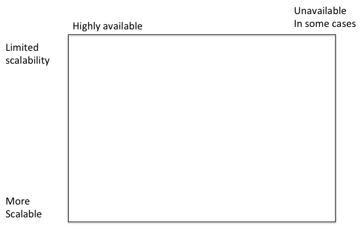

## Instructions

These questions are designed to introduce you to the notations,
question styles, and topics that will be tested on the final. The
percentage proportions associated with each topic will be the
percentages allocated to the questions on the final.

The final exam will consist of questions only on these topics. Most
questions will be in a style very similar to these but they will
typically focus on specific details or present an instance of this
topic and ask you to analyze it.  There may also be one or two
questions of an entirely different style, to test your ability to
respond to a new situation.

I will not be providing answers to these review questions, so **please do not
ask for answers.** You are encouraged to discuss your answers to this review
with as many other students in the class as you wish.

## CAP (25%)

1. What do the letters CAP stand for?

2. What is the main limitation highlighted by this principle? Express it in a sentence.

3. What trade-off have databases historically emphasized?

4. What is the new trade-off chosen by cloud-based systems?

5. What is the trade-off chosen by the designers of F1?

6. Given the following diagram, draw the line separating the two
regions separated by the CAP Principle. **Note:** The axes are
oriented differently from their counterparts in the "Distributed
Algorithms for NoSQL Databases" diagram.

7. On the diagram, mark the two points where the "My Little Image Sharer"
application would lie, and indicate why you would put it there, for the following two cases. You
may assume that S3 is itself scalable and partion-tolerant.

  * Only a single server.py instance
  * An arbitrary number of server.py instances

## The assignments (5%)

1. Diagram the architectures of My Little Image Sharer, Tea Emporium 1, and Tea Emporium 3 (final project)

## Forms of consistency, including the three Tea-Emporium assignments (40%)

1. What is the difference between eventual (weak) consistency and strong consistency?

3. Is the Tea Emporium 3 (the final project) system
partition-tolerant? If yes, how does it successfully respond to a
partition? If no, how does it fail when partition occurs?

4. Using the N, R, W notation from the lectures, characterize My Little Image Sharer. 

5. Imagine that we wanted to make Tea Emporium 3 (the final project) more partition-tolerant. How would the notion
of primary instance for an entity have to be revised?

7. How do vector clocks work? When are they useful?

8. Give an example of a series of calls to the Tea Emporium 3 (final project) system that produce an
eventually consistent result. Your answer should consist of a sequence
of GET and PUT calls, with the results of the GETs:

<table class="table">
<caption>Example answer</caption>
<thead>
<tr><th>Call</th><th>Arguments</th><th>EC read?</th><th>Response (if a GET)</th></tr>
</thead>
<tbody>
<tr><td>PUT</td><td>foo-tea, 4, {'c1':120}</td><td>NA</td><td>NA</td></tr>
<tr><td>GET</td><td>foo-tea</td><td>Yes</td><td>[A number]</td></tr>
</tbody>
</table>

Explain how your sequence demonstrates eventual consistency.

## Tail-tolerant design (10%)

1. What is the algorithm for hedged requests? When are they useful?

## Logging (5%)

1. What are five key features of a good logging service for a cloud system?

## Reliability (10%)

1. What do each of the Netflix "Monkeys" do? (Don't worry about their names, what do they _do_?)

## Sharding and replication (5%)

1. What is the difference between sharding and replication? When is each one useful?

