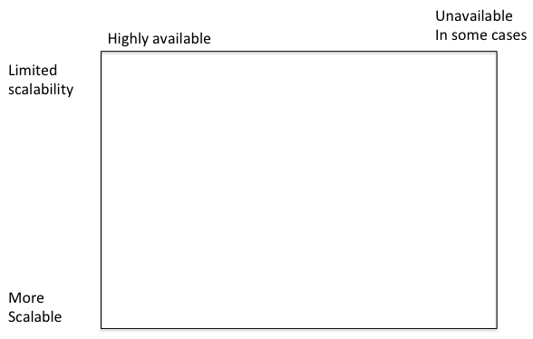

## Ensuring focused goals

Writing down a short list of _high-level_ goals gives me a focus for every aspect of the course:

[Syllabus](http://sfu-innovation.github.io/474-14-1/outcomes.html)

[Course outline (advertising the course to prospective students)](https://portal.cs.sfu.ca/portal/outlines/1141-CMPT-474-D100/)

[Weekly schedule](http://sfu-innovation.github.io/474-14-1/schedule.html)

## How do we characterize "kinds of outcomes"?

Bloom's cognitive levels

- Above principles all from  this category

Process skills/Program outcomes

- Presenting arguments typical to the field
- Critically assessing within genres typical to the field
- Reading diagrams typical to the field
- Team work
- Use of instruments, tools, or methods typical to the field
- Applying key principles across a range of domains

Values

- Some of the most heartfelt yet also most difficult to incorporate
- In a content-based course (and discipline!) these tend to be pushed into subtext
- I write these in terms of [choices I want the students to consider](http://www.cs.sfu.ca/CourseCentral/363/ted/363-11-1/outcomes.html)

## Example: How two learning outcomes drove a suite of activities

Cognitive outcome: 

Make appropriate tradeoffs of consistency versus availability for different features in a design. 
Level: Create

Process skill:

Reading diagrams typical to the field

Presentations organized around a consistency-availability diagram:

Assignments 5 and 6 asked students to design systems using these tradeoffs

Final exam

- Review used a modified form of the diagram

- Exam asked them to locate different assignments on the same diagram



## How do we characterize "degrees of mastery"?

Bloom's taxonomy of cognitive outcomes

1. Original---1959
2. More recent---2002, more flexible
 - Recall, Understand, Apply, Analyze, Evaluate, Create

Biggs's SOLO

- Prestructural
- Unistructural
- Multistructural
- Relational
- Extended abstract

ICE

- Ideas
- Connections
- Extensions

